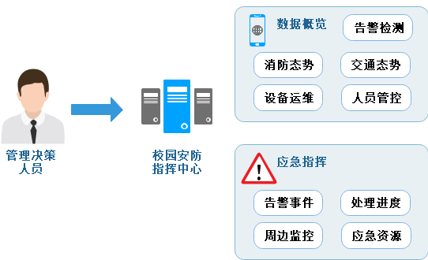

<h1 align="center" style="margin: 30px 0 30px; font-weight: bold;">图安校园安防智能保障系统</h1>
<h4 align="center">多终端校园安防解决方案</h4>

## 简介

项目根据用户需求分为校园安防综合管理平台[tuan-admin-ui](https://github.com/QJC1123/tuan-admin-ui)、校园安防指挥中心[tuan-control-center](https://github.com/QJC1123/tuan-control-center)、校园安防小程序[tuan-wx-ui](https://github.com/QJC1123/tuan-wx-ui)、模型管理系统[tuan-model-master](https://github.com/QJC1123/tuan-model-master)四大模块。“校园安防智能保障系统”项目获第十四届服务外包创新创业大赛**国家级二等奖**。

## 系统服务

* 校园安防后台管理系统实现基础信息、监控中心、告警中心、安防任务、用户管理、系统管理等操作。
* 校园安防小程序集成了归寝考勤、访客申请、隐患排查、值班考勤等功能。
* 校园安防指挥中心实现实时数据总览、应急指挥等功能。
* 模型管理系统具有数据集管理、模型训练、模型评估、模型部署功能。

## 四大平台
<table>
    <tr>
        <td>校园安防综合管理平台</td>
        <td><a href="https://github.com/QJC1123/tuan-admin-ui">https://github.com/QJC1123/tuan-admin-ui</a></td>
    <tr>
    <tr>
        <td>校园安防指挥中心</td>
        <td><a href="https://github.com/QJC1123/tuan-control-center">https://github.com/QJC1123/tuan-control-center</a></td>
    <tr>
    <tr>
        <td>校园安防小程序</td>
        <td><a href="https://github.com/QJC1123/tuan-wx-ui">https://github.com/QJC1123/tuan-wx-ui</a></td>
    <tr>
    <tr>
        <td>模型管理系统</td>
        <td><a href="https://github.com/QJC1123/tuan-model-master">https://github.com/QJC1123/tuan-model-master</a></td>
    <tr>
</table>

## 平台介绍
#### 校园安防综合管理平台

校园安防综合管理平台主要由数据总览、基础信息、校园监控、告警中心、安防任务、用户管理、系统管理七个模块构成。 
该平台主要面向安保管理员用户群体。数据概览模块能够快速获得该系统的大致信息，如人员、车辆、设备、告警事件等信息。管理员可以在基础服务模块中查询录入学生基本信息、教职工基本信息、车辆信息、设备信息、食堂信息，并在安防任务模块中查看寝室考勤情况、识别缺勤人员、隐患排查、查看访客申请记录、访客进入申请处理、值班考勤。管理员还可以在用户管理模块中管理用户创建账号、修改信息、删除账号、用户信息、开放操作权限。监控中心模块可以根据权限查看实时监控和历史监控。告警中心模块可以配置告警规则、查看告警事件及其处理进度，可以实现对通知类信息更好的整合与管理。系统管理模块可以进行数据监控、日志管理等操作。

#### 校园安防指挥中心

校园安防指挥中心整体部署于web端，主要为管理决策人员提供前端展示，包含数据总览、应急指挥两个模块。其中数据概览模块分为告警检测、消防态势、设备运维、交通态势、人员管控五个部分。应急指挥模块包括告警事件、处理进度、周边监控、应急资源。可以获取重点区域人流量、设备运维状态分析、消防资源信息、告警事件等信息。重点区域监测可以呈现重点区域安防信息详情，包括人流量、车辆、设备状态等信息。管理员还可以通过消防台式监测模块呈现消防区域、消防设备等要素的位置、面积、数量等信息，监控异常状态。应急指挥模块可以获取应急事件发生地信息，对于大型灾情事件可以人工进行指挥调度。

#### 校园安防小程序

校园安防小程序主要分为告警处置、值班考勤、隐患排查、归寝考勤四个模块。主要面向普通用户对象，如学校安保人员、学生本人、家长等。用户可以通过告警处置模块接收告警消息，上传告警处理结果，验收告警处理结果。安保人员在值班时发现安全警情后可以及时通过安全巡查模块处理并上报，验收警情处理结果。在发现隐患后还可以通过隐患排查上传隐患处理结果置小程序，并验收隐患处理结果。学生用户可以通过归寝考勤模块，进行人脸识别考勤、定位打卡。班主任、家长可以通过归寝考勤模块查看归寝情况统计、学生归寝记录情况等。

#### 模型管理系统

模型管理系统的服务对象为系统管理人员。 
该平台包括数据集管理、模型训练、模型评估、模型部署四个模块。系统管理员可以拥有该系统的登录和使用权限，能够完成对智能检测分析模型的训练与评估。可以通过数据集管理模块实现数据集的上传与数据集的标注管理。在模型训练板块可以实现新建训练、追加训练、配置训练参数、训练状态展示等功能。模型评估板块可以实现多维评判模型和训练结果展示等功能。管理员还可以通过模型部署模块完成一键模型部署，并且获取部署结果反馈。

